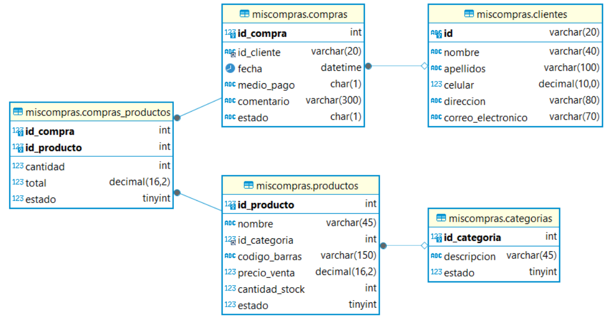

# PROYECTO EXAMEN MySQL

Joseph Samuel Ospina



## Consultas Básicas

Consultar todos los productos y sus categorías

```sql

```

Consultar todas las compras y los clientes que las realizaron

```sql

```

Consultar los productos comprados en una compra específica

```sql

```

Agregar un nuevo producto

```sql

```

Actualizar el stock de un producto

```sql

```

Consultar todas las compras de un cliente específico

```sql

```

Consultar todos los clientes y sus correos electrónicos

```sql

```

Consultar la cantidad total de productos comprados en cada compra

```sql

```

Consultar las compras realizadas en un rango de fechas

```sql

```


## Consultas usando funciones agregadas

Contar la cantidad de productos por categoría

```sql

```

Calcular el precio total de ventas por cada cliente

```sql

```

Calcular el precio promedio de los productos por categoría

```sql

```

Encontrar la fecha de la primera y última compra registrada

```sql

```

Calcular el total de ingresos por ventas

```sql

```

Contar la cantidad de compras realizadas por cada medio de pago

```sql

```

Calcular el total de productos vendidos por cada producto

```sql

```

Obtener el promedio de cantidad de productos comprados por compra

```sql

```

Encontrar los productos con el stock más bajo

```sql

```

Calcular el total de productos comprados y el total gastado por cliente.

```sql

```


## Consultas usando join

Consultar todos los productos con sus categorías Consultar todas las compras y los clientes que las realizaron

```sql

```

Consultar los productos comprados en cada compra

```sql

```

Consultar las compras realizadas por un cliente específico

```sql

```

Consultar el total gastado por cada cliente

```sql

```

Consultar el stock disponible de productos y su categoría

```sql

```

Consultar los detalles de compras junto con la información del cliente y el producto

```sql

```

Consultar los productos que han sido comprados por más de una cantidad específica

```sql

```

Consultar la cantidad total de productos vendidos por categoría

```sql

```

Consultar los clientes que han realizado compras en un rango de fechas específico

```sql

```

Consultar el total gastado por cada cliente junto con la cantidad total de productos
comprados

```sql

```

Consultar los productos que nunca han sido comprados

```sql

```

Consultar los clientes que han realizado más de una compra y el total gastado por ellos

```sql

```

Consultar los productos más vendidos por categoría

```sql

```

Consultar las compras realizadas por clientes de una ciudad específica y el total gastado

```sql

```

Consultar los proveedores que han suministrado productos y la cantidad total suministrada

```sql

```


## Subconsultas

Consultar los productos que tienen un precio de venta superior al precio promedio de todos
los productos

```sql

```

Consultar los clientes que han gastado más del promedio general en sus compras

```sql

```

Consultar las categorías que tienen más de 5 productos

```sql

```

Consultar los productos más vendidos (top 5) por categoría

```sql

```

Consultar los clientes que han realizado compras en los últimos 30 días

```sql

```

Consultar las compras y sus productos para un cliente específico, mostrando solo las
compras más recientes

```sql

```

Consultar las categorías que tienen productos con un stock por debajo del promedio general

```sql

```

Consultar los productos que han sido comprados por todos los clientes

```sql

```

Consultar las compras que tienen más productos que el promedio de productos por compra

```sql

```

Consultar los productos que se han vendido menos de la cantidad promedio de productos
vendidos

```sql

```

